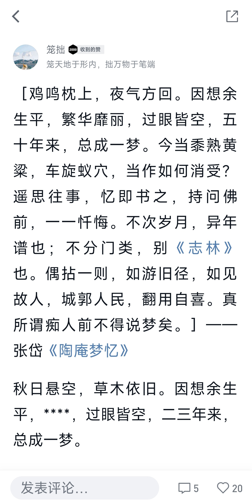

# 2022年10月总结

## 十月第四周总结

- 买了《陶庵梦忆》；
- 《挤地铁》；
- 每天下班之后没有心情学习。
- 存档计划正式启动；
- 10月29日，和小量、老方一起吃火锅，打牌。

### 《陶庵梦忆》
在翻看自己 `微信读书` 想法的点赞记录时，看到了自己仿写《陶庵梦忆》开篇自序的一段话：
> ［鸡鸣枕上，夜气方回。因想余生平，繁华靡丽，过眼皆空，五十年来，总成一梦。今当黍熟黄粱，车旋蚁穴，当作如何消受？遥思往事，忆即书之，持问佛前，一一忏悔。不次岁月，异年谱也；不分门类，别《志林》也。偶拈一则，如游旧径，如见故人，城郭人民，翻用自喜。真所谓痴人前不得说梦矣。］——张岱《陶庵梦忆》
秋日悬空，草木依旧。因想余生平，****，过眼皆空，二三年来，总成一梦。
想来吴明晋也有类似的感觉，但终不及张岱之强烈，吴明晋有的只是因为无法再有较高的物质上的享受，也不能悠哉悠哉的尸位素餐了，或许还有对前途命运的担忧，可能还有内心的矛盾吧（虽然内心已经认可了澳洲人，但是几十年的人生经验已经根深蒂固:'既食君禄，君即尔父'、'一朝为臣，终身为臣'。他的大脑无时无刻都在提醒他:你是大明的臣子。但是他却选择睁一眼闭一眼。没有对抗，没有选择自尽，而是选择默许，而是选择享受着澳洲人提供的丰富的物质。将来还有可能合作，这又与他所信仰的士大夫风骨极为矛盾。），但是这些感觉也只是转瞬即逝，可能十几年后，雷州发展到了临高的水平，坐在藤椅上的吴明晋牙快掉光了，受不了冰的刺激了，只能乐呵呵地扇着蒲扇，看着自己的孙子孙女吃着刨冰，喝着冰酸梅汤。待乏了，头靠在藤椅上闭目养神，回想刚才的场景，想起自己含饴弄孙，只觉得'还是澳洲人好啊'。。。都不会记得自己曾经还有过这样的感觉，更不要说为后人所记。时间往后推十几年，另一个时空的张岱写下的《陶庵梦忆》，那种国破家亡，那种深沉忏悔的感觉，即使跨越几百年的时空，我依然能感受到。

顿时激起了兴趣，而且我想提升一下自己的文笔，于是就买了《陶庵梦忆》。

PS: 这条想法已经得到 20 个赞了。

### 《挤地铁》
这周的某个早上，我被人流裹挟着挤上了从黄贝岭前往湖贝的地铁，身不由己。便写下了这段话：
> 就这样被推搡着，挤着，被人流裹挟着上了地铁，脚无立锥之地。可是我并不想上这列车，我想等下一列。我想生气，可是我生不起来，因为往后的无数个日子里，这样的事情会不断重演。就像江中落叶，时代洪流中的普罗大众，被一种有形、无形的力量推着向前，而不管你愿不愿意。

### 无心学习
这个问题也是我目前最大的问题了。

感觉白天的上班时间已经把我一天的精力全部耗尽了，只想沉浸在低级的快乐中。晚上回家洗完澡后，打开B站，我知道我应该点开 `收藏` 中的《黑马程序员 MySQL数据库入门到精通，从mysql安装到mysql高级》。但是连续两个晚上我点开的都是首页里面的推荐内容，心想“先划一会儿水吧，都上了一天的班了”，可是一划水就划到了 11 点钟，再也没有心情学习了，这是其一。

其二，我想，还是没有在学习的过程中得到正反馈。

在学习 mysql 的过程中，只是看一遍视频，然后抄一下笔记，没有进一步思考，也没用起来（没有应用场景），所以学的越来越没意思。而且在 linux 环境安装 mysql 时搞的筋疲力尽，最后 Ubuntu 也不知道被我使用了哪条命令后搞得无法正常使用了，不知道怎么复原又无法卸载，心态爆炸。

也就是说学习的过程中要么没有反馈，要么是负反馈。。。

我想还是得合理的利用上班的时间，在上班的时候尽快完成自己的开发任务，剩下的时间就用来学习，不要想着下班后再学，真的没有精力了。

那么该如何尽快地完成开发任务呢，**我想还是得尽快的熟悉各种业务场景**，而不是去钻研框架，那么应该把论坛买的那两本关于电商的书用起来。不再去抄一遍，而是用 tp 框架把一个个业务场景写成接口，再输出一篇博客。涉及到配置的通通不要，就像我写短信接口一样。

现阶段先把 mysql 的学习停了吧，等我熟悉了大部分业务场景时，或者遇到了 mysql 性能问题时，再继续往下学吧。

### 火锅打牌
昨天和哥几个一起去吃了顿火锅，好吃是好吃，不过也蛮贵的。

吃完后，一起去了老方的住处，打了一下午的牌。从下午一点打到晚上九点半。自从小量来了这里之后，周六打牌就成了惯例。在算计得分、走分的过程中忘记了各种烦恼，不过快乐的时光总是短暂的。。。

### 世说新语

新能源人：新冠常态化核酸期间，每隔一段时间必须做核酸检测进行“充电”保住绿码，才能继续行动的人类。

有一次去老方那里时核酸记录是 48 小时，忘记去做核酸了，但是晚上打算回来时已经是72小时了，尽管在老方那里做了核酸，但是不在检测中，到了地铁安检口那里被拦住了，不让上地铁，本来想坐公交的，但是想想公交应该是和地铁一样的，超过了 48 小时就不让上。于是直接找了辆小黄车，打算骑车回去。但是没想到一路这么凶险，有好几段路就像在自行车的游戏里面，有角度很大的斜坡。最要命的是有一段路没有自行车道，一会儿一辆大车。大车摁一下喇叭，吓得我一个激灵。胆战心惊，于是一路狂骑，用最短的时间骑过了那段路。不过最终有惊无险，安全地回到了住处。

## 最后
今天就到这了，也写了挺久的，算是开了一个好头吧。不过最难的还是坚持，最终还是要培养成习惯，达到不完成这件事就会少了什么一样。

—— 写于 2022 年 10 月 30 号 12 点 18 分